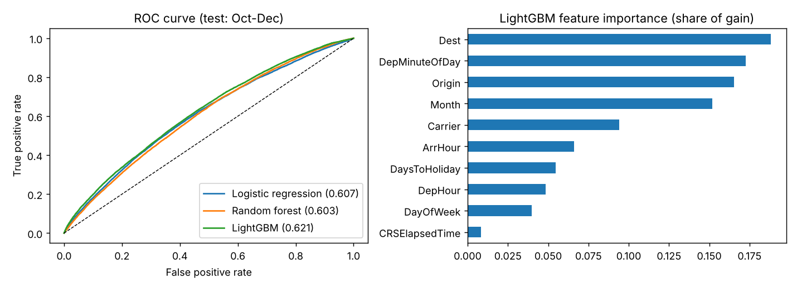

# Flight Delay Predictor

Enter a scheduled US domestic flight (route, airline, date, departure and arrival time) and get the probability that it arrives **15+ minutes late**, plus the main factors behind the estimate.

Round 1 uses **schedule-only features** (nothing that is only known after departure). Weather is planned for round 2.



## Results

Time-based split: trained on **Jan-Sep 2017**, tested on **Oct-Dec 2017** (500k-flight sample of the BTS On-Time Performance data). Random splits would leak same-week weather and congestion, so they are not used.

| Model | ROC-AUC | PR-AUC | Precision | Recall |
|---|---|---|---|---|
| Always "on time" (baseline) | 0.500 | 0.148 | n/a | n/a |
| Logistic regression | 0.607 | 0.207 | 0.222 | 0.292 |
| Random forest (120k-row subsample) | 0.603 | 0.198 | 0.197 | 0.460 |
| **LightGBM** (deployed) | **0.621** | **0.219** | 0.242 | 0.260 |

PR-AUC baseline is the test delay rate (14.8%). Precision and recall use a threshold picked on a September validation slice.

**What I found**
- Schedule information alone only weakly predicts delays: AUC around 0.62 is what one year of schedule data supports. That is expected, because most delays come from weather, air traffic and aircraft knock-on effects.
- Removing `DayofMonth` improved the test AUC (0.612 to 0.620): it let the model memorise specific 2017 storm days. `Route` added nothing over `Origin` + `Dest`.
- Most important features: destination, departure time of day, origin, month, airline.
- Train delay rate (19.8%) is higher than test (14.8%) because delays peak in summer, so thresholds do not transfer perfectly across seasons.

The deployed model is refit on all 12 months. The table above is from the Jan-Sep fit.

## Features (all known before departure)

Airline, origin, destination, month, day of week, weekend flag, scheduled departure hour and minute-of-day, scheduled arrival hour, scheduled flight time, distance, distance in days to the nearest US federal holiday.

Deliberately excluded because they leak the answer: departure delay, taxi times, wheels-off, actual times, delay-cause columns.

## Run it

```bash
pip install -r requirements.txt -r requirements-train.txt
python scripts/make_dataset.py      # downloads BTS 2017 data, writes data/flight_delay_data.csv
python src/train.py                 # trains all models, writes models/ and reports/
uvicorn app.main:app --reload       # http://localhost:8000
```

Docker:

```bash
docker build -t flight-delay .
docker run -p 8000:8000 flight-delay
```

API:

```bash
curl -X POST localhost:8000/api/predict -H "Content-Type: application/json" -d \
 '{"carrier":"DL","origin":"JFK","dest":"LAX","date":"2026-12-23","dep_time":"17:30","arr_time":"20:45"}'
```

## Deploy

Any Docker host works. On Render or Railway: create a new web service from this repo and pick the Dockerfile. The app reads `$PORT` automatically.

## Project layout

```
src/features.py     feature engineering shared by training and serving
src/train.py        model comparison, time split, saves the model
app/main.py         FastAPI service (/api/predict, /api/options)
app/static/         the web form
models/             model.joblib and route metadata (committed, small)
scripts/            dataset builder
```

## Limitations

- US domestic flights from 2017 only. Routes and airlines outside the data are rejected.
- No weather, no live traffic, no aircraft rotation (the previous flight's delay). These are the biggest missing signals.
- Distance and scheduled flight time come from the route's historical median, not the user's input.
- Probabilities are modest by nature (most flights land between 6% and 45%). Treat the output as a risk estimate, not a certainty.

## Roadmap

1. Round 2: add hourly weather at origin and destination (Open-Meteo) and measure the AUC gain.
2. Congestion features (scheduled departures per airport-hour).
3. Previous-flight delay via tail number, for predictions made a few hours before departure.

Data: US Bureau of Transportation Statistics, Reporting Carrier On-Time Performance.
