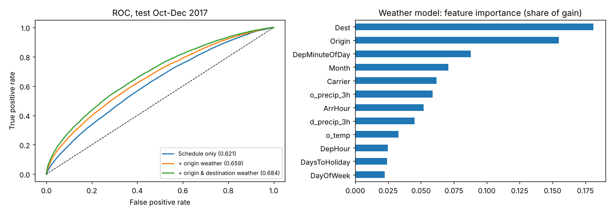
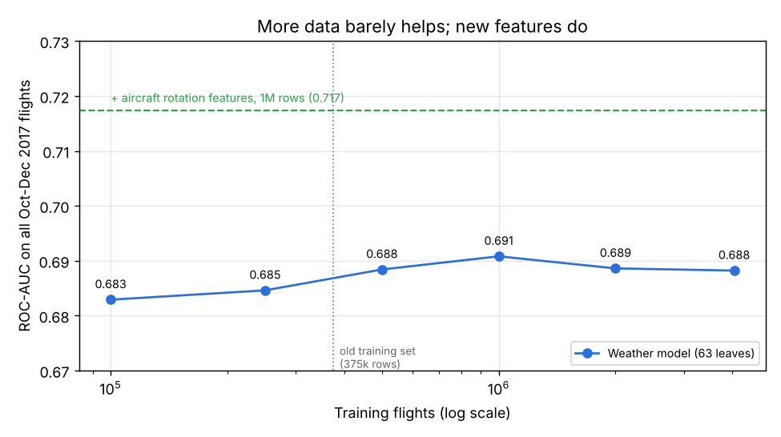
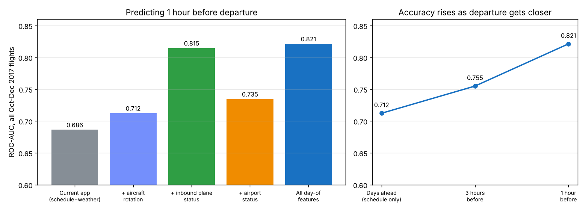

# Flight Delay Predictor

Enter a scheduled US domestic flight (route, airline, date, departure and arrival time) and get the probability that it arrives **15+ minutes late**, plus the main factors behind the estimate.

Round 1 uses **schedule-only features** (nothing that is only known after departure). Weather is planned for round 2.


## Results

Time-based split: trained on **Jan-Sep 2017**, tested on **Oct-Dec 2017** (500k-flight sample of the BTS On-Time Performance data). Random splits would leak same-week weather and congestion, so they are not used.

| Model | ROC-AUC | PR-AUC | Precision | Recall |
|---|---|---|---|---|
| Always "on time" (baseline) | 0.500 | 0.148 | n/a | n/a |
| Logistic regression | 0.607 | 0.207 | 0.222 | 0.292 |
| Random forest (120k-row subsample) | 0.603 | 0.198 | 0.197 | 0.460 |
| **LightGBM** (deployed) | **0.621** | **0.219** | 0.242 | 0.260 |

PR-AUC baseline is the test delay rate (14.8%). Precision and recall use a threshold picked on a September validation slice.

**What I found**
- Schedule information alone only weakly predicts delays: AUC around 0.62 is what one year of schedule data supports. That is expected, because most delays come from weather, air traffic and aircraft knock-on effects.
- Removing `DayofMonth` improved the test AUC (0.612 to 0.620): it let the model memorise specific 2017 storm days. `Route` added nothing over `Origin` + `Dest`.
- Most important features: destination, departure time of day, origin, month, airline.
- Train delay rate (19.8%) is higher than test (14.8%) because delays peak in summer, so thresholds do not transfer perfectly across seasons.

The deployed model is refit on all 12 months. The table above is from the Jan-Sep fit.

## Round 2: adding weather

Hourly weather for the 200 busiest airports (97% of flights) from the Open-Meteo archive, joined at the **origin at the scheduled departure hour** and the **destination at the scheduled arrival hour** (local time, red-eyes roll to the next day). Same split, same LightGBM settings.



| Model | ROC-AUC | PR-AUC | Precision | Recall |
|---|---|---|---|---|
| Schedule only | 0.621 | 0.219 | 0.242 | 0.260 |
| + origin weather | 0.659 | 0.265 | 0.291 | 0.284 |
| **+ origin & destination weather** | **0.684** | **0.301** | 0.308 | 0.336 |

- Weather adds **+0.063 AUC** and **+37% PR-AUC**. Destination weather matters almost as much as origin weather.
- The gain is biggest when it matters most: on departures in rain, snow or strong gusts (6% of test flights, 28.5% of them delayed), AUC rises from **0.598 to 0.723**.
- Most useful weather signals: 3-hour precipitation at origin and destination, temperature, dew-point spread (fog/low-cloud risk), pressure, low cloud.
- The archive is reanalysis data and never reports fog, thunderstorm or freezing-rain codes, so those flags were constant in training and are dropped automatically.

Run it with `python scripts/fetch_weather.py` (about an hour, resumable) then `python src/train_weather.py`.

## Round 3: the full dataset (5.6M flights)

Does more data help? I trained the same weather model on 100k up to all ~4M Jan-Sep flights and scored every run on **all 1.4M Oct-Dec flights**.



| Training flights | 100k | 250k | 500k | **1M** | 2M | 4M |
|---|---|---|---|---|---|---|
| ROC-AUC | 0.683 | 0.685 | 0.688 | **0.691** | 0.689 | 0.688 |

- **More rows barely help.** The gain flattens around 1M flights and slightly drops after, while the model keeps adding trees (4,000 at full size). The limit is **seasonal drift**, not data volume: the model learns Jan-Sep patterns that do not carry over to autumn and winter.
- **The full schedule unlocks new features**, which a sample cannot provide (`src/feature_experiments.py`, 1M training rows, same test):

| Features | ROC-AUC | PR-AUC | Usable in the app today? |
|---|---|---|---|
| Weather model | 0.691 | 0.315 | yes |
| + typical airport congestion | 0.690 | 0.315 | yes, but no gain |
| + same-day congestion | 0.689 | 0.315 | no gain |
| **+ aircraft rotation** | **0.717** | **0.369** | needs the plane's schedule |

- **Aircraft rotation** = which leg of the plane's day this is and the scheduled turnaround since its previous flight (tight turns let delays carry over). It is the strongest new signal: +0.026 AUC, +17% PR-AUC. Leakage check: the dataset drops cancelled flights, which cluster on bad days, so I recomputed rotation from the complete schedule including cancellations. The score moved only from 0.719 to 0.717, so the gain is real.
- **Congestion adds nothing**: the model already learns airport and hour patterns from the airport and time features.

**Shipped:** both app models are now trained from the full dataset (`src/train_full.py`: 1M rows for tuning, 1.15M rows from all 12 months for the final fit). Same accuracy, but the app now accepts **4,422 routes and 7,369 airline-route pairs** (up from 3,350 and 4,702).

## Features (all known before departure)

Airline, origin, destination, month, day of week, weekend flag, scheduled departure hour and minute-of-day, scheduled arrival hour, scheduled flight time, distance, distance in days to the nearest US federal holiday.

Deliberately excluded because they leak the answer: departure delay, taxi times, wheels-off, actual times, delay-cause columns.

## Run it

```bash
pip install -r requirements.txt -r requirements-train.txt
python scripts/make_dataset.py      # downloads BTS 2017 data, writes a 500k sample (data/flight_delay_data.csv)
python src/train.py                 # round 1 model comparison on the sample
python scripts/make_dataset.py --full   # all 5.6M flights (data/flights_2017_full.parquet)
python src/train_full.py            # trains the deployed models (needs the weather file too)
uvicorn app.main:app --reload       # http://localhost:8000
python -m pytest -q                 # tests (simulated forecasts, no network needed)
```

Docker:

```bash
docker build -t flight-delay .
docker run -p 8000:8000 flight-delay
```

API:

```bash
curl -X POST localhost:8000/api/predict -H "Content-Type: application/json" -d \
 '{"carrier":"DL","origin":"JFK","dest":"LAX","date":"2026-12-23","dep_time":"17:30","arr_time":"20:45"}'
```

## Round 4: day-of prediction (AUC 0.82)

Days ahead, a model only knows the schedule and a forecast, and published studies land around 0.70-0.75 there too. Closer to departure, much more is known. `src/dayof_experiment.py` predicts **1 hour before departure** using only information that would really exist at that moment:

- **Inbound aircraft:** the plane's previous flight today: its departure delay if it has already left, its arrival delay if it has already landed, and the resulting slack before our departure. Times from the previous airport are converted to our airport's clock via scheduled times.
- **Origin airport right now:** share of departures in the previous 2 hours that left 15+ minutes late, and their mean delay.
- Nothing from the flight's own departure or arrival is used.



| Features (1M training rows, all Oct-Dec 2017 flights as test) | ROC-AUC | PR-AUC |
|---|---|---|
| Current app model (schedule + weather) | 0.686 | 0.309 |
| + aircraft rotation (schedule) | 0.712 | 0.364 |
| + origin airport status | 0.735 | 0.404 |
| + inbound aircraft status | 0.815 | 0.599 |
| **All day-of features** | **0.821** | **0.609** |

- **The inbound plane is the strongest signal by far**: PR-AUC doubles. Top features: inbound slack, then the previous flight's departure delay.
- **Leakage check:** the same model predicting **3 hours** before departure scores 0.755, between the days-ahead model (0.712) and the 1-hour model (0.821). Accuracy falls smoothly as less of the inbound flight has happened, which is what honest features should do. The time logic is also unit-checked by hand on a three-leg example.
- By inbound state at 1 hour out: inbound plane in the air 0.846, not yet departed 0.809, first flight of the day 0.762, already landed 0.727.
- (Row A is 0.686 here vs 0.691 in round 3 only because this run draws a different random 1M training sample.)

Using this in the app needs live data: the aircraft assigned to the flight and its previous flight's status (both available from flight-status APIs on the day of travel).

## Flight number lookup (optional)

Type a flight number and date (e.g. `DL 423`) and the app fills in the route, airline and scheduled local times from the [AeroDataBox](https://rapidapi.com/aedbx-aedbx/api/aerodatabox) API, then runs the prediction. Multi-leg flights let you pick the leg; codeshare listings resolve to the operating airline; non-US or untrained routes are flagged instead of guessed.

Setup: get a free RapidAPI key (Basic plan, about 400 units a month), copy `.env.example` to `.env` and set `AERODATABOX_KEY`. Lookups are cached for 6 hours. Without a key the flight-number box is hidden and manual entry still works.

## Deploy

Any Docker host works. On Render or Railway: create a new web service from this repo and pick the Dockerfile. The app reads `$PORT` automatically.

## Project layout

```
src/features.py     feature engineering shared by training and serving
src/train.py        model comparison, time split, saves the model
app/main.py         FastAPI service (/api/predict, /api/options)
app/static/         the web form
models/             model.joblib and route metadata (committed, small)
scripts/            dataset builder
```

## Limitations

- US domestic flights from 2017 only. Routes and airlines outside the data are rejected.
- The weather model is trained on *actual* (reanalysis) weather, but a live app can only use *forecasts*, which are less accurate, so live accuracy will be somewhat below the test score. Forecasts only reach 16 days ahead; beyond that the app falls back to the schedule-only model.
- The app uses the weather model only for flights in the next 16 days with both airports' forecasts available; otherwise it falls back to the schedule-only model and says so on the page.
- No live traffic and no aircraft rotation (the previous flight's delay).
- The model only knows airlines and routes from 2017: airlines that started or merged since then (for example Breeze, or Virgin America into Alaska) can be looked up but not predicted.
- Distance and scheduled flight time come from the route's historical median, not the user's input.
- Probabilities are modest by nature (most flights land between 6% and 45%). Treat the output as a risk estimate, not a certainty.

## Roadmap

1. ~~Round 2: hourly weather at origin and destination~~ (done: AUC 0.621 to 0.684).
2. ~~Live forecasts in the app~~ (done: Open-Meteo forecasts for both airports, 30-minute cache, schedule-only fallback).
3. Prediction logging plus a feedback loop: real outcomes from monthly BTS releases, a "was it delayed?" button, and monthly retraining that only ships a new model if it beats the current one.
4. Recent BTS data (2023-2025) instead of 2017.
5. Day-of mode in the app (AUC 0.82 in testing): for flights departing within a few hours, look up the assigned aircraft and its previous flight's live status, plus recent departure delays at the origin.

Data: US Bureau of Transportation Statistics, Reporting Carrier On-Time Performance.
